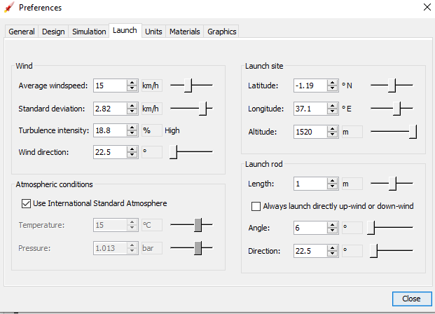
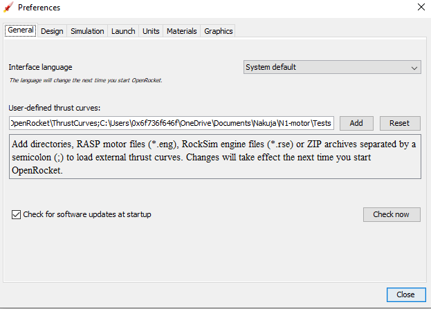

# Airframe version 1

This is project repo for the airframe containing all our design and simulations for the model rocket


   

## Table of contents

* [General info](#general-info)
* [Technologies](#technologies)
* [Setup](#setup)

## General info

This project is where our initial openrocket design files for the nakuja N1 rocket are placed. This is how it looks from simulation. 


## Technologies

Project is created with:

* [Openrocket](https://openrocket.info/) [version v15.03](https://github.com/openrocket/openrocket/releases/download/release-15.03/OpenRocket-15.03.jar)
* VScode for documentation

## Setup

1. To run this project, install openrocket in your machine using this [procedure](http://wiki.openrocket.info/Downloading_%26_Installing). Once you have set up openrocket proceed by:

```bash

$ git clone https://github.com/nakujaproject/airframe_openrocket
$ cd airframe_openrocket
# Open OpenRocket and open the design files, simulation.ork

```

2. After opening the OpenRocket Application, Head over to Edit then Preference menu. Configure the atmospheric condition. My configs look like this:



3. Move over to the materials tab and add the material you are intending to use if it is not included.


4. Get the motor thrust curves from Nakuja Propulsion Team for N1 motor

```sh
git clone https://github.com/nakujaproject/N1-motor.git
# This is the folder that contains all the N1 motor rockets done it testing
```

5. If you want to use the N1 motors created by the Nakuja Propulsion team, go to general settings then under the user defined curves add `N1-motor\test` directory, that we have just cloned, inside there.


