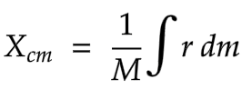
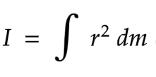
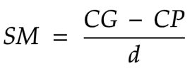
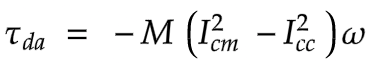
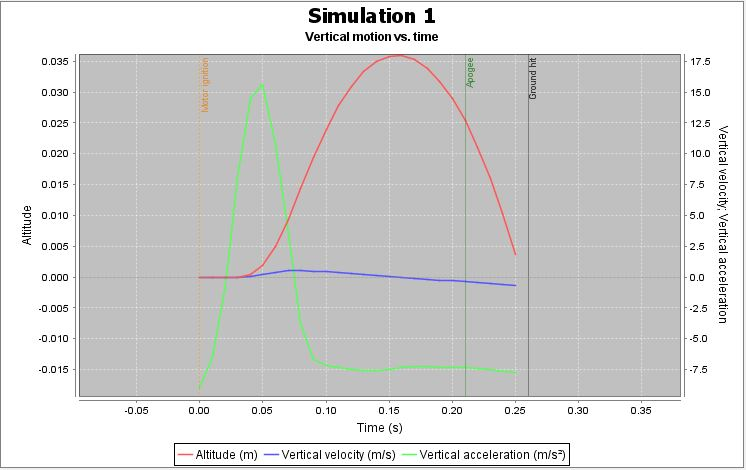
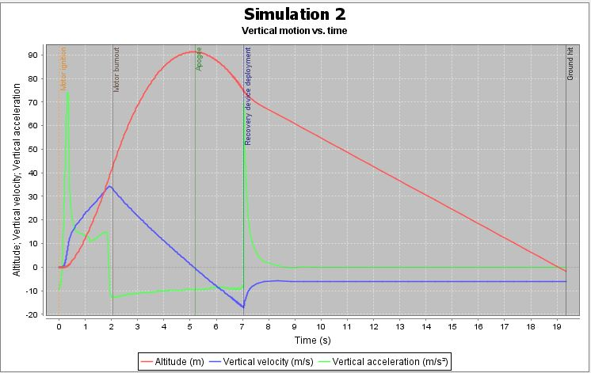

# airframe_openrocket
This is airframe openrocket design and simulation. This was our first design process in order to visualise the rocket. We first implemented the rocket having nose cone, payload chamber and body. We then simulated it with two motors to check the apogee of the model rocket.

## Nose cone
From the research done by apogeerockets on different nose cones at [their website](https://www.apogeerockets.com/education/downloads/Newsletter346.pdf). If you want your rocket to go the highest while maintaing the lowest draf force you use long eliptical. Parabolic goes the furtherest but you sacrifice your drag force.

## Findings
The centre of gravity should be higher than the centre of pressure.

### Centre of mass
The centre of mass of the rocket and it's component parts lie on the axis of symmetry, wich is the roll axis of the rocket. We define it along the roll axis. It is defined by: 

where r is the sistance from centre and dm is mass along roll axis M is the total mass of the rocket

### Moment of inertia
Similarly the moment of inertia of the rocket about axis of rotation is defined as:

where r is the distance of an infinitesimal volume with mass dm from the axis of rotation.

### Centre of pressure
You can calculate the center of pressure. But, in general, this is a complicated procedure requiring the use of calculus. The aerodynamic forces are the result of pressure variations around the surface of the rocket. In general, you must determine the integral of the pressure times the unit normal, times the area, times the distance from a reference line. Then divide by the integral of the pressure times the unit normal, times the area. Lot's of work!

For more information check out this [website](https://estesrockets.com/wp-content/uploads/Educator/TIR_33_Center_of_Pressure.pdf)

### Stability margin
Stability is usually judged by the stability margin (SM), where the distance between the center of gravity and center of pressure is divided by the diameter d of the rocket body,

The centre of gravity is dependant on the burn tme. During th launch the center of gravity moves to the frint of the rocket. The centre of pressure is dependant on the velocity in air.

### Thrust damping
The expulsion of mass from the rocket nozzle has a further effect on the rocket’s dynamics and this is to damp angular rotations of the rocket by generating a torque in the opposite direction to the rotation. This is caused by the lateral acceleration of the hot rocket gas as it travels
down the motor tube [Duncan & Ensey, 1964].
The torque due to thrust damping is given by

where M˙
is the mass expulsion rate of the fuel, lcn is the distance between the centre of mass of
the rocket and the nozzle exit, lcc is the distance between the centre of mass of the rocket and
the centre of mass of the fuel and ω is the angular velocity of the rocket.

## Simulation
OpenRocket simulates an ideal rocket flying in an ideal virtual world. But some parameters can vary e,g:
- Local air density
- Manufactures variations
- Local wind speed and direction
- Imperfect match of simulated model and real model

But what we gain from it are insights on how our rocket will behave and most probably how it will perform.

We had three sections namely:
1. Nose cone
2. Payload chamber
3. Body tube

The payload chamber contained the altimeter, our electronics, shoch cord to hold the parachute and tube coupler.
For our body tube, we used three trapezoidal fins, a lauch lug, inner tube to hold the motor, centering to holding the inner tube to the walls of the body tube, parachute and also shock cord.

Our motor configs were split up into two:
1. MicroMaxx2
This had an average thrust of 0.464N and a max thrust of 3.21N
The burn time was approximate 0.64s and the launch mass was 1.2g.
Its motor thrust curve is given by

After we ran our simulation we found out that this motor would give us:
- apogee of 0.036m 
- time to reach max height 0.16s
- time of flight 0.25s
- max velocity 0.692m/s

Our simulation results were

2. C6-5
This had an average thrust of 4N and a max thrust of 11.6N
The burn time was approximate 1.86s and the launch mass was 22g.
Its motor thrust curve is given by

After we ran our simulation we found out that this motor would give us:
- apogee of 91.1m 
- time to reach max height 5.16s
- time of flight 19.3s
- max velocity 34.4m/s

Our simulation results were

## Modelling the rocket
To get the most accurate model, you should weigh every component. And once components are assembled, you should weigh each section to check your work, comparing it to OpenRocket's calculated masses