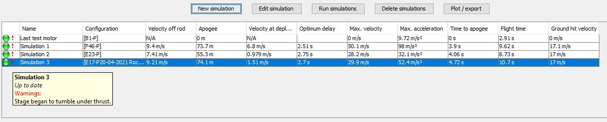
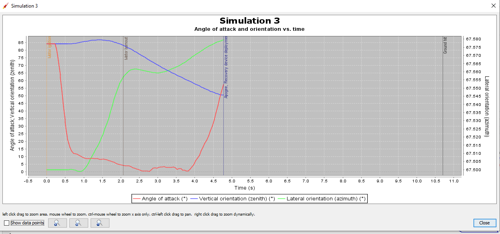
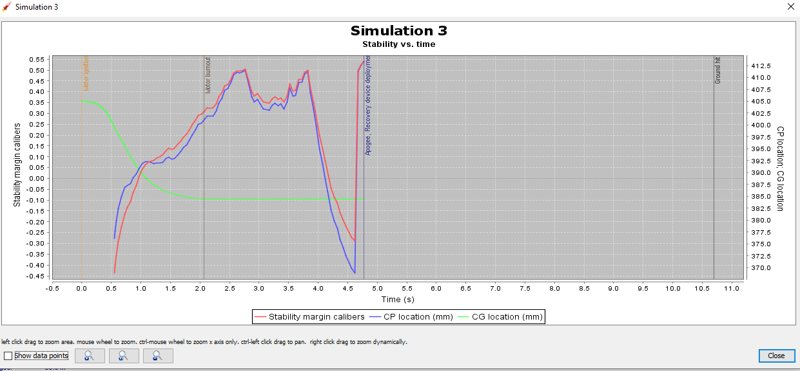

# 20-04-2021

## Theory

Stability is of importance in any rocket design. A small disturbance, e.g in wind, may cause the rocket to tilt from its current orientation. When this occurs, the rocket centerline is no longer parallel to the velocity of the rocket. This condition is called flying at an angle of attack, where the angle between the rocket centerline and the velocity vector.

When a stable rocket flies at an angle of attack, its fins produce a moment to correct the rocket’s flight. The corrective moment is produced by the aerodynamic forces perpendicular to the axis of the rocket. The moment produced attempts to correct the rocket’s flight only if the CP is located after of the CG. If this condition holds, the rocket is said to be statically stable. A statically stable rocket always produces a corrective moment when flying at a small angle of attack.

Model rockets may encounter several types of dynamic instability depending on their shape, size and mass

1. Continuous oscillation when trying to correct the path of the rocket due to large changes. This causes to little oscillation dumping.
2. The corrective moment is too small compared to the moment of inertia of the rocket. Before the rocket has been able to correct its orientation, the thrust of the motors may have already significantly affected the direction of flight.
3. If the model has a natural roll frequency close to the oscillation frequency of the rocket, roll-pitch resonance may occur and cause the model to go unstable.

## Results

As we can see, it was expected that our rocket would tumble under thrust since the airframe was for a previous version of the motor. When the new airframe will be up and ready we will try again and see the changes.

Wind plays a critical role in the flight of model rockets. As has been seen, large angles of attack may cause rockets to lose a significant amount of stability and even go unstable. Over-stable rockets may weathercock and turn into the wind. In a perfectly static atmosphere a rocket would, in principle, fly its entire flight directly upwards at zero angle of attack.

The center of mass is important in rocket flight because it is around this point that an unstable rocket tumbles. As a matter of fact, any object in flight tends to tumble. Throw a stick, and it tumbles end over end. The act of spinning or tumbling is a way of becoming stabilized in flight.

The stability of the rocket is constantly under the requires stability of 1.5-2.5. This will result in issues where the rocket can't correct itself thus tumbling.
