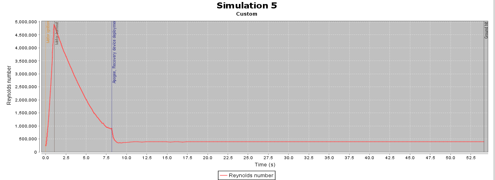
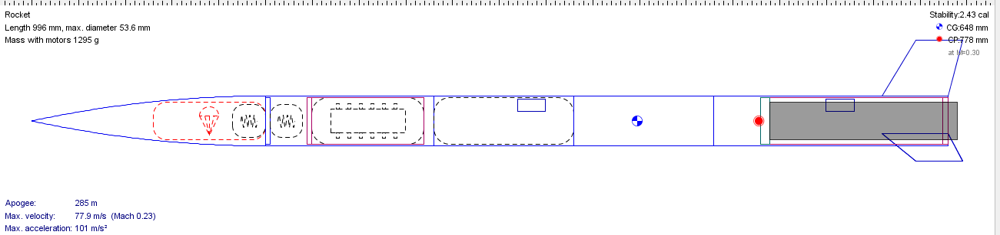

# Progress

## 28-04-2021 Details

### 1. Added three motors and the simulation results are here. I have used 4 models. The G146-P is the highest expected outcome. The G106-P and G108-P motor is the expected outcome. E17-P is the baseline outcome, which should do better than it.

### 2. [G106-P] Profiled the flight profile graph and the results are here. We can see that we have a range of 40m diamter circle on where the rocket will hit the ground from the launch site

### 3. [G106-P] Added the comparision of Reynolds number with time as the time changes

### 4. [G106-P] Added the stability results from the flight time. We can clearly see our values are greater than 1.5 which is the minimu required stability of the rocket

### 5. [G106-P] Simulation results for the current motor configs are here. This shows the results from all the three motors in our test bench

### 6. [G106-P] Vertical motion graph results are here. This represents vertical accelration and vertical velocity of the rocket during its time of flight

### 7. [G106-P] Model rocket verion is here. Added the electroncics bay as an inner tube in order to hold the altimeter

## 13-04-2021 Details

### 1. Added the Nakuja propulsion expected F87-P and G168-P motor to check for the simulations results

### 2. Changed the airframe height to 1.1m to maintain stability

### 3. Increase nose cone lenghth

### 4. Increases another body tube to maintain stability

## 11-04-2021 Details

### 1. Added the Nakuja propulsion expected F46-P motor to check for the simulations results

## 09-04-2021 Details

### 1. Added three motors and the simulation results are here. I have used 4 models. The G74-W is the highest expected outcome. The F37-6 motor is the expected outcome. E15-7 is the baseline outcome, which should do better than it. B1-P is the latest motor tested by the propulsion team

### 2. [F37-6 motor] Profiled the flight profile graph and the results are here. We can see that we have a range of 40m diamter circle on where the rocket will hit the ground from the launch site

### 3. [F37-6 motor] Added the comparision of Reynolds number with time as the time changes

### 4. [F37-6 motor] Added the stability results from the flight time. We can clearly see our values are greater than 1.5 which is the minimu required stability of the rocket

### 5. [F37-6 motor] Simulation results for the current motor configs are here. This shows the results from all the three motors in our test bench

### 6. [F37-6 motor] Vertical motion graph results are here. This represents vertical accelration and vertical velocity of the rocket during its time of flight

### 7. [F37-6 motor] Model rocket verion is here. Added the electroncics bay as an inner tube in order to hold the altimeter

